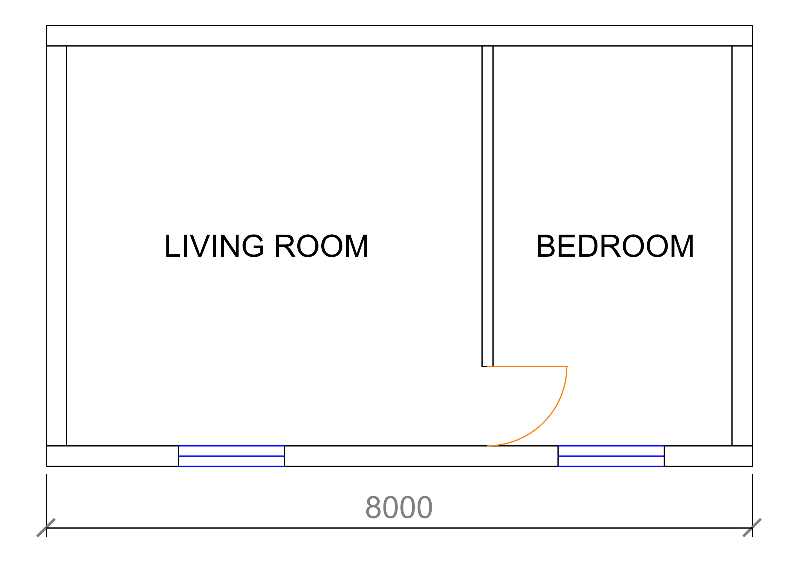
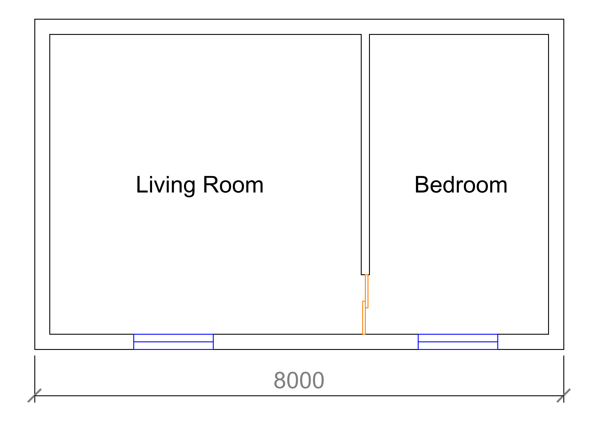
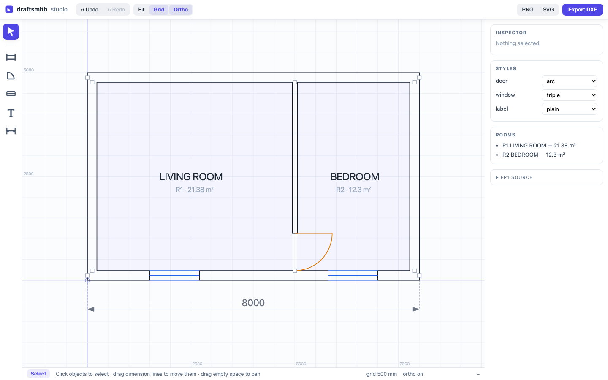

# draftsmith

**A floorplan scene-graph engine** — for LLM-agent drafting, synthetic
dataset generation, human design tooling, and SDK/plugin embedding.

draftsmith separates floorplan *facts* (walls, doors, windows — the
semantic scene graph) from *depiction* (style-compiled DXF/SVG/PNG) and
from *derived truth* (rooms, areas, adjacency — always computed, never
stored). One engine, four surfaces. Architecture: [DESIGN.md](DESIGN.md);
milestones: [ROADMAP.md](ROADMAP.md).

## Current status: M1 — scene-graph core

A floorplan is a small semantic document in **FP1**, a token-efficient
format built for LLM context windows (~4× denser than JSON; this whole
plan is ~65 tokens):

```
FP1 mm
W1 0,115 8000,115 t230
W2 0,4885 8000,4885 t230
W3 115,230 115,4770 t230
W4 7885,230 7885,4770 t230
W5 5000,230 5000,4770 t120
D1 W5@0 w900 hinge=far
N1 W1@1500 w1200
N2 W1@5800 w1200
L1 2500,2500 "LIVING ROOM"
L2 6450,2500 "BEDROOM"
M1 0,0 8000,0 d-700
```

```python
from draftsmith import compile_scene, parse
from draftsmith.geometry import summary

scene = parse(open("docs/sample.fp").read())
summary(scene)
# {'walls': 5, 'doors': 1, 'windows': 2,
#  'rooms': [{'id': 'R1', 'label': 'LIVING ROOM', 'area_m2': 21.38, ...},
#            {'id': 'R2', 'label': 'BEDROOM',     'area_m2': 12.3,  ...}],
#  'connections': [{'opening': 'D1', 'kind': 'door', 'rooms': ['R1', 'R2']}, ...]}

sk = compile_scene(scene)   # style compiler -> primitives
sk.save("plan.dxf")
sk.render("plan.png")
```

Rooms, areas and door/window connectivity are *derived* by the geometry
module (Shapely wall-body unions — mitres and jambs come free), and the
style compiler draws the same scene under interchangeable depictions
(doors: `arc`/`double`/`sliding`, windows: `triple`/`frame`, labels:
`plain`/`caps`/`title`) — the variety axis for synthetic datasets.

| default styles | `!S door=sliding window=frame label=title` |
|---|---|
|  |  |

## Studio — the interactive layer

`draftsmith ui` launches a local web app (stdlib-only server, single-file
frontend) where the same scene is edited graphically: draw walls (with
endpoint snapping and Shift-ortho), click a wall to place doors/windows,
label rooms, dimension, select/delete, undo — with rooms, areas and the
FP1 source updating live. The FP1 panel is two-way: edit the text, hit
Apply, and the canvas follows.

Every graphical action is a named engine op recorded through the action
journal (`draftsmith.journal.Recorder`); replaying a journal reproduces
the plan exactly. Run with `--journal session.jsonl` to persist/resume a
session — this is also the future usage-data channel, and the same op
vocabulary the LLM-agent surface will drive.

```bash
uv run draftsmith ui --open docs/sample.fp --journal session.jsonl
```



## Agent surface — toolless drafting loop

An LLM drafts floorplans by *speaking FP1*, no tool-calling required:

```bash
draftsmith prompt                   # system prompt for the chat session
draftsmith check plan.fp --render plan.png   # validate + geometric feedback
```

Paste the brief into a chat session primed with the system prompt; the
model replies with an FP1 block; `check` returns room areas, door/window
connectivity (`D2 door R1 <-> R2`), warnings (unclosed walls, labels
outside rooms, interior windows), or a precise parse error to paste
back. See a real first-shot exchange with Claude Sonnet in
[docs/agent_example.md](docs/agent_example.md).

Or skip the copy-paste entirely: **the studio has a built-in chat panel**
wired to your local `claude` CLI (toolless print-mode Sonnet by default;
`--chat-model` to change). Describe a plan — or ask for changes to what
you drew by hand — and the model's FP1 lands on the canvas live, with
engine feedback shown in the thread and invalid replies retried
automatically. Every chat edit goes through the action journal, so it is
undoable and recorded like any manual edit.

## Quickstart

```bash
uv sync

# Compile an FP1 scene to DXF and PNG
uv run draftsmith compile docs/sample.fp -o plan.dxf -o plan.png

# Generate the sample floorplan DXF and render it to PNG + SVG
uv run draftsmith demo -d demo/

# Render any DXF file
uv run draftsmith render path/to/drawing.dxf -o out.png
uv run draftsmith render path/to/drawing.dxf -o out.svg --dark

# Run tests
uv run pytest
```

## Design notes

- **Why DXF, not images?** DXF is a structured, layered, semantically
  meaningful format — the native language of CAD. It gives agents an
  editable scene graph rather than pixels, and gives evaluation (step 5) a
  ground truth to diff against.
- **Why a renderer first?** The render loop is the agent's feedback channel:
  draw → render → inspect → correct. Everything downstream depends on it.
- 3D DXF content currently renders as a flat projection; a true 3D viewport
  arrives with the web viewer in step 3.
