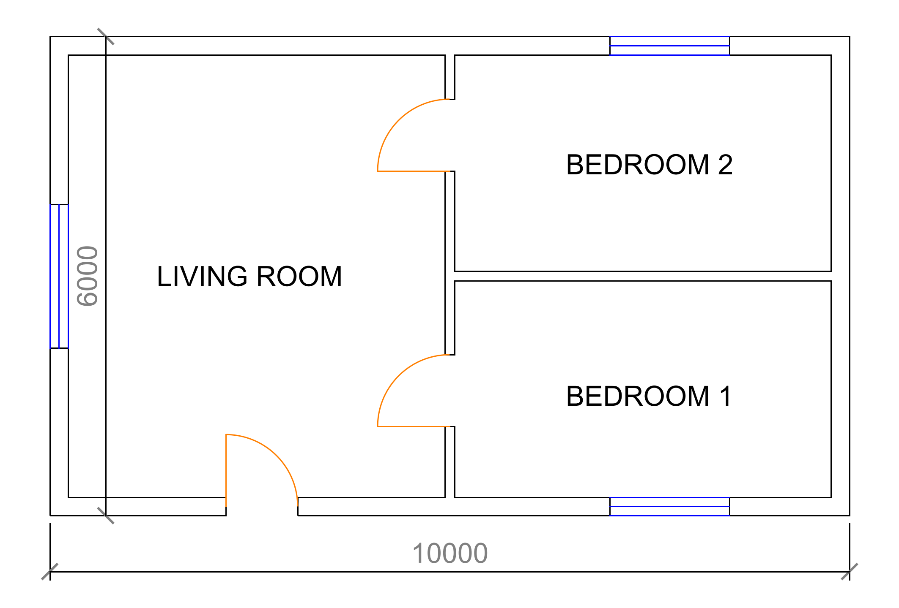

# Example: toolless drafting-agent exchange (M2)

A real exchange with Claude Sonnet acting as the drafting agent — no
tools, pure chat, using the system prompt from `draftsmith prompt`.

**Brief** (user message):

> A 10 m × 6 m single-storey apartment. Living room occupies the western
> half. The eastern half is split into two equal bedrooms, one north one
> south. Each bedroom has a door from the living room. The living room
> has an entrance door in its south wall and one window; each bedroom
> has one window in an exterior wall. Label all rooms and give overall
> width and height dimensions.

**Agent reply** (first attempt — [docs/agent_example.fp](agent_example.fp)):

```fp
FP1 mm
!S door=arc window=triple label=plain
W1 0,115 10000,115 t230
W2 0,5885 10000,5885 t230
W3 115,230 115,5770 t230
W4 9885,230 9885,5770 t230
W5 5000,115 5000,5885 t120
W6 5000,3000 9885,3000 t120
D1 W1@2200 w900
D2 W5@1000 w900
D3 W5@4200 w900
N1 W3@1870 w1800
N2 W1@7000 w1500
N3 W2@7000 w1500
L1 2500,3000 "LIVING ROOM"
L2 7500,1500 "BEDROOM 1"
L3 7500,4400 "BEDROOM 2"
M1 0,0 10000,0 d-700
M2 0,0 0,6000 d-700
```

**Engine feedback** (`draftsmith check plan.fp --render plan.png`):

```
OK: 6 walls, 3 doors, 3 windows, 3 labels, 2 dims
rooms:
  R1 "BEDROOM 1"       12.76 m2  bbox 5060,230 -> 9770,2940
  R2 "LIVING ROOM"     26.09 m2  bbox 230,230 -> 4940,5770
  R3 "BEDROOM 2"       12.76 m2  bbox 5060,3060 -> 9770,5770
connections:
  D1 door   R2 <-> EXT
  D2 door   R1 <-> R2
  D3 door   R2 <-> R3
  N1 window R2 <-> EXT
  N2 window R1 <-> EXT
  N3 window R3 <-> EXT
extents: 0,0 -> 10000,6000
```



**Observations** (research log):

- Valid FP1 and a brief-satisfying plan on the **first attempt**: equal
  12.76 m² bedrooms, western living room, correct door/window topology,
  zero warnings. The agent used T-joints (interior walls ending on
  exterior centerlines) which the geometry engine seals correctly.
- One error the *textual* feedback cannot see: the height dimension
  `M2 … d-700` put the dimension line **inside** the building (wrong
  sign for that edge). Geometrically valid, visually wrong — exactly the
  class of mistake the M5 feedback-modality ablation (text vs render
  feedback) is designed to measure.
